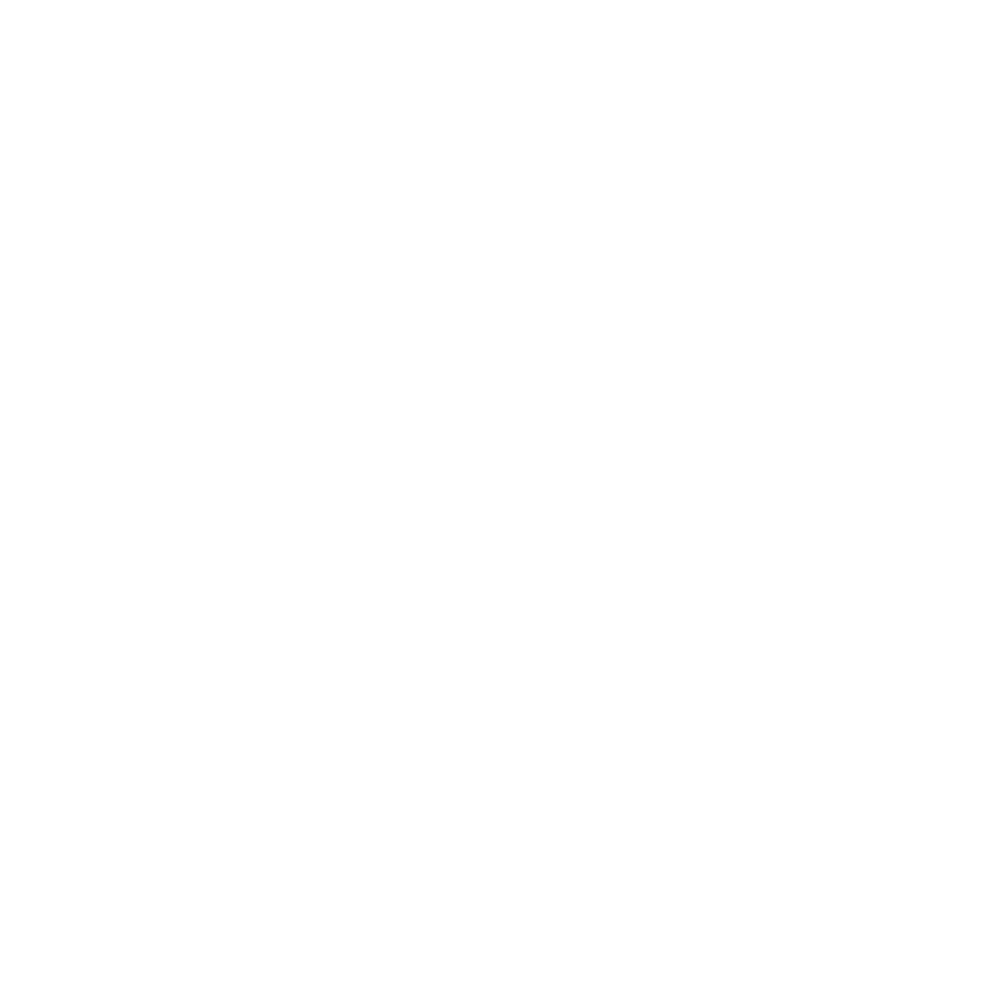

# 3D Models of Distributed Systems 

## Kim Schlesinger
### Denver DevOps Meetup, March 2020 

--- 
Building handmade 3D models of distributed systems will increase your team's understanding of your cloud infrastructure. 

--- 

Source: [https://deniseyu.io/art/sketchnotes/topic-based/raft.png](https://deniseyu.io/art/sketchnotes/topic-based/raft.png)

--- 
“Mental model calibration” 
* Incident analysis is one way (John Alls) 
* Blameless discussions optimized for learning 
* Not accepting human error as the cause 

Denise Yu, ["Why Are Distributed Systems So Hard?"](https://www.usenix.org/conference/srecon19americas/presentation/yu) 

--- 

Source: https://www.youtube.com/watch?v=aIakcp_OTLA

--- 

--- 

# Agenda 
* The road to yaml engineering   
* The power of mental models 
* Demo 
* How to build a 3D Model of a Distrbuted System

--- 

