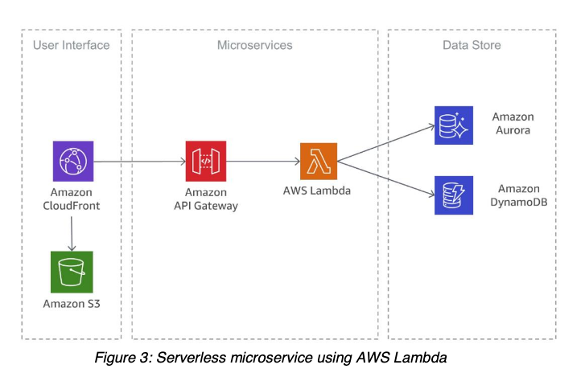

footer: @kimschles

## 3D Models of Distributed Systems 

### Kim Schlesinger

#### Denver DevOps Meetup, March 2020 

--- 
### Building handmade 3D models of distributed systems will increase your team's understanding of your cloud infrastructure. 

--- 


--- 


[^1]

[^1]: [How Does RAFT Work?, deniseyu.io](https://deniseyu.io/art/sketchnotes/topic-based/raft.png)

--- 
# Mental Model Calibration[^2]
* Incident analysis 
* Blameless discussions optimized for learning 
* Not accepting human error as the cause

[^2]: Denise Yu, "Why are Distributed Systems So Hard?", [SRECon Americas 2019](https://www.usenix.org/conference/srecon19americas/presentation/yu)


--- 


[^3]

[^3]: [MeAnshika YouTube Channel](https://www.youtube.com/watch?v=aIakcp_OTLA)

--- 


--- 

# Agenda 
* How did we become yaml engineers?
* Mental Models
* 3D Models of Distributed Systems

--- 
# Agenda  
* **How did we become yaml engineers?**   
* Mental Models
* 3D Models of Distributed Systems

--- 
# Agenda  
* How did we become yaml engineers?
* **Mental Models**
* 3D Models of Distributed Systems

---

> A mental model is simply a representation of how something works.[^4]

[^4]: [Farnam Street, What Are Mental Models?](https://fs.blog/mental-models/#what_are_mental_models)

---
  [^5]


[^5]: [Quizlet: AWS VPC Networking Security Overview](https://quizlet.com/306576306/aws-vpc-networking-security-overview-diagram/)

---

 [^6]

[^6]: [Implementing Microservices on AWS](https://d1.awsstatic.com/whitepapers/microservices-on-aws.pdf)

---

 [^7]

[^7]: [Wikimedia Kubernetes](https://commons.wikimedia.org/wiki/File:Kubernetes.png)

---
 [^8]

[^8]: [Kubernetes Docs, What is Ingress?](https://kubernetes.io/docs/concepts/services-networking/ingress/#what-is-ingress)

---
 [^9]

[^9]: [Designing Distributed Systems Labs, Ambassador Pattern](https://github.com/brendandburns/designing-distributed-systems-labs/blob/master/1.%20Single%20Node%20Pattern/1.1.%20Request%20Splitter/images/AmbassadorPattern.png)

---
# Agenda  
* How did we become yaml engineers?
* Mental Models
* **3D Models of Distributed Systems** 

--- 
 [^9]

[^9]: [Designing Distributed Systems Labs, Ambassador Pattern](https://github.com/brendandburns/designing-distributed-systems-labs/blob/master/1.%20Single%20Node%20Pattern/1.1.%20Request%20Splitter/images/AmbassadorPattern.png)

---
 [^10]

[^10]: [Request Splitter Lab](https://github.com/brendandburns/designing-distributed-systems-labs/tree/master/1.%20Single%20Node%20Pattern/1.1.%20Request%20Splitter)

---
```bash
$ ks@MBP:~/designing-distributed-systems-labs/1. Single Node Pattern/1.1. Request Splitter$ 💀 k get all

NAME                                         READY   STATUS    RESTARTS   AGE
pod/ambassador-deployment-56989f7c59-49tfl   1/1     Running   0          3d
pod/ambassador-deployment-56989f7c59-jt97c   1/1     Running   0          3d
pod/experiment-deployment-bf75f8d7-5hbbt     1/1     Running   0          3d
pod/experiment-deployment-bf75f8d7-8pgqd     1/1     Running   0          3d
pod/web-deployment-6664fd5c85-mkljp          1/1     Running   0          3d
pod/web-deployment-6664fd5c85-s5qcm          1/1     Running   0          3d

NAME                            TYPE           CLUSTER-IP      EXTERNAL-IP   PORT(S)        AGE
service/ambassador-deployment   LoadBalancer   10.96.114.17    <pending>     80:31401/TCP   3d
service/experiment-deployment   ClusterIP      10.96.111.182   <none>        80/TCP         3d
service/web-deployment          ClusterIP      10.96.33.154    <none>        80/TCP         3d

NAME                                    READY   UP-TO-DATE   AVAILABLE   AGE
deployment.apps/ambassador-deployment   2/2     2            2           3d
deployment.apps/experiment-deployment   2/2     2            2           3d
deployment.apps/web-deployment          2/2     2            2           3d

NAME                                               DESIRED   CURRENT   READY   AGE
replicaset.apps/ambassador-deployment-56989f7c59   2         2         2       3d
replicaset.apps/experiment-deployment-bf75f8d7     2         2         2       3d
replicaset.apps/web-deployment-6664fd5c85          2         2         2       3d
```


---
# Before
* Decide on an existing system 
* Pick one small part 
* Find the code or console output
* Gather your craft materials 
 
---
# During 
* Build the model
* Refer to your code or console output 
* Have fun and make mistakes 
* Talk about it
* Be done

---
# After 
* Describe what's accurate and what's not
* Record your new understandings 

--- 


Recap 

--- 


## kimschlesinger.com
## @kimschles
