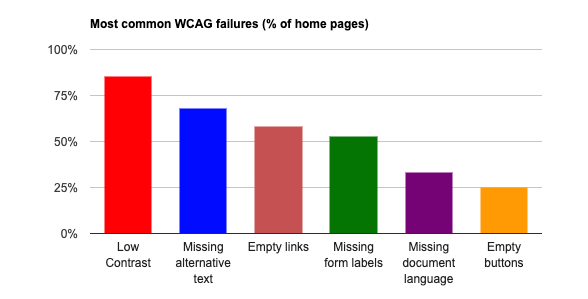
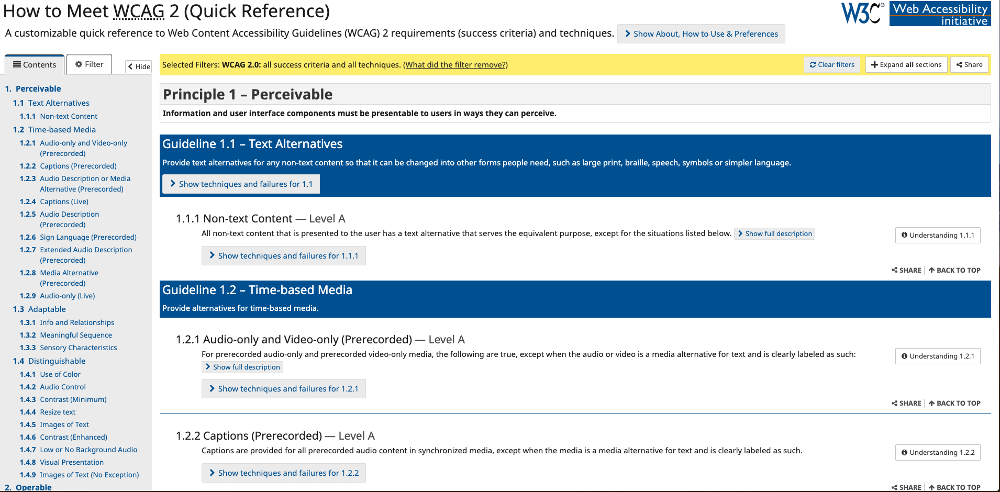

footer: @kimschles


# Refactoring for Accessibility 


### Kim Schlesinger
### Denver Node.js Meetup - May 2019

--- 
## An accessibility refactor will improve your product and your codebase more effectively than a code-only refactor. 


--- 


# Kim Schlesinger
### Ops, Education & Software 


--- 


---


^ Company is ~2 years old 
Platform is pushed out quickly with lots of developers 
Corners were cut 
I'm leaving at the end of the month 


---
# Roadmap 

1. Why
1. What 
1. How

--- 


^ Why? 

---
## I thought I knew more than I did... 


^ I have a master's degree in special education, I taught special education and worked with students who used assistive technology, I get the a11y newsletter and I've been to the Front Range Accessibility and Inclusive Design Meetup

--- 


--- 
# Dunning-Kruger Effect

> is a psychological phenomenon in which people of the lowest ability in a subject rate themselves as most competent compared to others.

-- [Hubspot](https://blog.hubspot.com/marketing/dunning-kruger)

--- 
# [WebAIM Million](https://webaim.org/projects/million/)




97.8% of home pages had detectable WCAG 2 failures

--- 

## 2.2% of home pages had no WCAG 2 failures

--- 

# 👎🏼

--- 


--- 
# What is accessibility? 

> Web accessibility means that websites, tools, and technologies are designed and developed so that people with disabilities can use them. 

--WC3 Web Accessibility Initiative

--- 
# Question: How do we know when something is accessible and when it's not? 

--- 

# Answer: STANDARDS

--- 


---
# Web Standards 


### The World Wide Web Consortium

Goal: Interoperability between different types of computers and browsers

--- 
# A short list of W3C Standards

* HTML
* CSS
* DOM
* XML
* ARIA 
* XForms
* MathML

---
# WCAG 

## Web Content Accessibility Guidelines
### Versions 2.0 and 2.1 

--- 
# POUR 

### Perceivable
### Operable
### Understandable
### Robust

--- 
# [WCAG 2.0 Guidelines](https://www.w3.org/WAI/WCAG21/quickref/?versions=2.0&showtechniques=11)




---


--- 
# Other standards or guidelines 

* Section 508

--- 


---

## 1. Use multiple tools to identify accessibility issues 

---
## WAVE Extension 


--- 
## alt text 

--- 
# Before 

```javascript
const CompanyProfileCard = (props : Props) => (
  <CustomCard onClick={props.onClick}>
      <Media left>
        <Link to={`/company/${props.id}`}>
          <Media object src={props.logo} width="100" alt="Logo"/>
        </Link>
      </Media>
```

---
# Before 

[.code-highlight: 5]

```javascript
const CompanyProfileCard = (props : Props) => (
  <CustomCard onClick={props.onClick}>
      <Media left>
        <Link to={`/company/${props.id}`}>
          <Media object src={props.logo} width="100" alt="Logo"/>
        </Link>
      </Media>
```

---
# After 

[.code-highlight: 5]

```javascript
const CompanyProfileCard = (props : Props) => (
  <CustomCard onClick={props.onClick}>
      <Media left>
        <Link to={`/company/${props.id}`}>
          <Media object src={props.logo} width="100" alt={`${props.name} logo`}/>
        </Link>
      </Media>
```
---

## Use JS template literals to dynamically populate alt text for images. 

---
## Checklists, Exemplars and Screenreaders

* [A11y Checklist](https://a11yproject.com/checklist)
* Good examples you can deconstruct 
    * [The A11y Project](https://a11yproject.com/)
    * [Eric Bailey Design](https://ericwbailey.design/writing/2019-03-05-fighting-uphill.html)
    * [Inclusive Design Principles](https://inclusivedesignprinciples.org/)
* Manual Testing with a Screen Reader 

---

# Provide a “Skip to main content” link 

---

### Add the skip nav code, or component, to the top of your header 


---

```js
import React from 'react';

const SkipNav = () => (
    <ul id="section-skipnav" aria-label="Skipnav" role="navigation">
        <li className="skipnav-item">
            <a href="#section-main">Skip to Main Content</a>
        </li>
        <li class="skipnav-item">
            <a href="/accessibility-statement">Accessibility Statement</a>
        </li>
    </ul>
);

export default SkipNav;
``` 

---
```css
.skipnav-item {
border: 0;
clip: rect(0, 0, 0, 0);
height: 1px;
margin: -1px;
overflow: hidden;
padding: 0;
position: absolute;
width: 1px;
}
```

--- 
 ```html
<main id="section-main">
```


---
## Skip Navigation Links

* Create a way for people using screen readers to skip to the main content of the page 

* If you're using a JS framework, make this a component you can easily reuse

--- 
# 1. Use multiple tools to identify issues 

--- 
## 2. Commit to accessibility being an ongoing process, not a one time fix

---
# Accessibility Statement 

--- 
```javascript
import React from 'react';

const SkipNav = () => (
    <ul id="section-skipnav" aria-label="Skipnav" role="navigation">
        <li className="skipnav-item">
            <a href="#section-main">Skip to Main Content</a>
        </li>
        <li class="skipnav-item">
            <a href="/accessibility-statement">Accessibility Statement</a>
        </li>
    </ul>
);

export default SkipNav;
``` 

---
[.code-highlight: 9]
```javascript
import React from 'react';

const SkipNav = () => (
    <ul id="section-skipnav" aria-label="Skipnav" role="navigation">
        <li className="skipnav-item">
            <a href="#section-main">Skip to Main Content</a>
        </li>
        <li class="skipnav-item">
            <a href="/accessibility-statement">Accessibility Statement</a>
        </li>
    </ul>
);

export default SkipNav;
``` 

---
# Why? 
* Show your users that you care about accessibility and about them
* Provide them with information about the accessibility of your content
* Demonstrate commitment to accessibility, and to social responsibility 
-- [W3C Web Accessibility Initiative](https://www.w3.org/WAI/planning/statements/)


---
# Examples 

* [diversity Accessibility Statement](https://hirediversity.us/accessibility-statement/)
* [Eric Bailey Accessibility Statement](https://ericwbailey.design/accessibility-statement.html)

--- 
## Accessibility Statement
* Include an accessibility statement to state your intentions, your known accessibility issues and how to contact someone if there are barriers to access 
* Continue working on making your site accessible, and update your statement as needed 

--- 

## An accessibility refactor will improve your product and your codebase more effectively than a code-only refactor. 


---


# What Can I Do? 


--- 
# If you work at a company

* Find ways to discuss accessibility with people in positions of leadership
* Offer to lead a lunch and learn on the topic 


--- 
# If you're in school 
* Ask your instructor when you'll be covering accessibility in the curriculum. 
* If it will not be covered, respectfully ask 'why not?'
* Give a lightning talk or lesson about the topic

--- 
# Everyone 

* Attend the the [Front Range Accessibility and Inclusive Design Meetup](https://www.meetup.com/a11yFR/) in Boulder! 
* Subscribe to the A11y Weekly Newsletter 
* Come to Develop Denver! 

--- 
# Recap 

1. Why 
1. What
1. How

---
# How

1. Use multiple tools to identify issues 
1. Commit to accessibility being an ongoing process, not a one time fix
1. Insist that developing accessible applications is core to your organization

---
# Accessibility Resources
* [Wave Web Accessibility Evaluation System](http://wave.webaim.org/)
* [a11y Web Accessibility Checklist](https://a11yproject.com/checklist)
* [Inclusive Design Principles](https://inclusivedesignprinciples.org/)
* [Eric Bailey: Fighting Uphill](https://ericwbailey.design/writing/2019-03-05-fighting-uphill.html)
* [Crystal Preston-Watson Demystifying Accessibility Talk](https://www.youtube.com/watch?v=p3IJFMVKWyk)

--- 
# Questions


--- 


# Contact Me

**kimschlesinger.com**
**developdenver.org** 
**hirediversity.us** 

@kimschles 
on twitter, github and twitch

