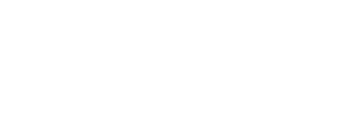

footer: kimschles
slidenumbers: true

---

# Kim Schlesinger
### Ops, Education & Software 

--- 

--- 

--- 

---

# Accessibility 

---
# Accessibility 
Lessons Learned: 
* There not one tool to rule them all 
* Another one here 
* Another one here 
* Accessibility Statement 

---

# Accessibility 
## WAVE Extension 

--- 

const CompanyProfileCard = (props : Props) => (
  <CustomCard onClick={props.onClick}>
    <Media style={{
      paddingTop: '20px',
      paddingLeft: '20px'
    }}>
      <Media left>
        <Link to={`/company/${props.id}`}>
          <Media object src={props.logo} width="100" alt="Logo"/>
        </Link>
      </Media>

const CompanyProfileCard = (props : Props) => (
  <CustomCard onClick={props.onClick}>
    <Media style={{
      paddingTop: '20px',
      paddingLeft: '20px'
    }}>
      <Media left>
        <Link to={`/company/${props.id}`}>
          <Media object src={props.logo} width="100" alt={`${props.name} logo`}/>
        </Link>
      </Media>

--- 

Skip Nav

Add it to the top of your header component

--- 
What Can You Do? 

Find accessible sites and inspect the source HTML 

Company? Ask what you're doing 
School? Ask when that is covered, and if not why 
* offer lesson
Attend the FRA meetup in Boulder 

---
# Accessibility Resources
* [Wave Web Accessibility Evaluation System](http://wave.webaim.org/)
* [a11y Web Accessibility Checklist](https://a11yproject.com/checklist)
* [Inclusive Design Principles](https://inclusivedesignprinciples.org/)
* [Crystal's dvlp dnvr Talk]()
* [Eric Bailey: Fighting Uphill](https://ericwbailey.design/writing/2019-03-05-fighting-uphill.html)

--- 
# Questions

---

# Writing 'just enough' unit and integration tests

---

# Refactoring React Components

--- 

# Contact Me

**kimschlesinger.com**
**developdenver.org** 
**hirediversity.us** 

@kimschles 
on twitter, github and twitch

