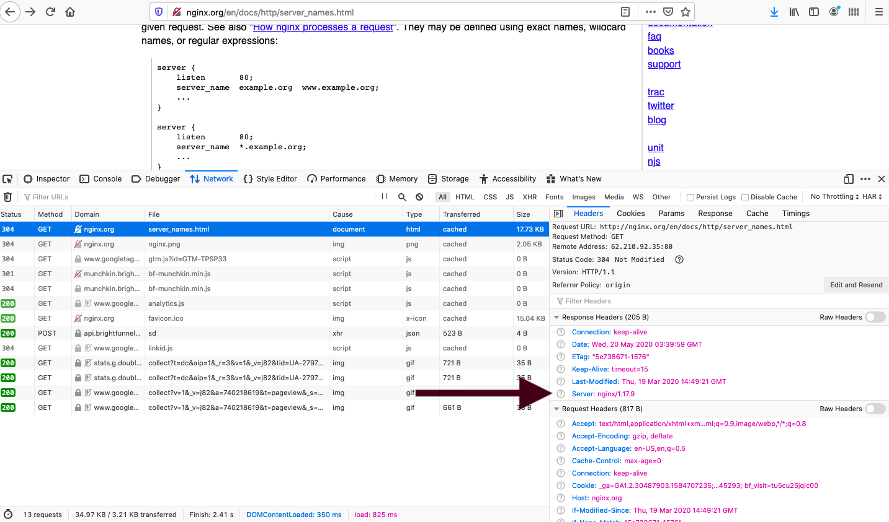

footer: @kimschles

## nginx and Node.js 

### Kim Schlesinger

#### Denver Node.js Meetup - May 2020 

--- 

nginx and Node.js are a dream team for serving your production traffic. 

--- 

# Kim Schlesinger


--- 

# Agenda 
1. About nginx   
1. Demo setup 
1. nginx as a
    * Reverse Proxy 
    * Web Cache
    * Load Balancer 
1. Recap  

--- 
# Agenda 
1. About nginx


--- 


--- 
# About nginx 

* pronounced "engine-x" 
* A web server, reverse proxy and load balancer 
* First developed in 2004 by Igor Sysoev 
* Designed to solve the C10K Problem[^1]

[^1]: Concurrently handling ten thousand connections

---
# Moar about nginx 
* Open Source nginx and nginx Plus
* Serves 28.5% active sites on the web[^2]
    * Apache is 2nd with 27.8% websites

[^2]: [Netcraft April 2020 Web Server Survey](https://news.netcraft.com/archives/category/web-server-survey/)

--- 

## How do I know which webserver is serving my content? 


--- 

## Look at the http response headers using your browser's dev tools.

* Open dev tools
* Go to the network tab
* Refresh the page
* Look at response headers 

---



--- 
Something about nginx and node.js 

--- 

Something about JS programming vs. configuration management 

--- 
# Agenda 
1. About nginx   


--- 
# Agenda 
1. About nginx   
1. Demo setup 

--- 
# Demo Setup 
* Digital Ocean Droplet 
    * Ubuntu `18.04.3`
* Dockerized Node.js apps 
    * Code at [github.com/kimschles/nginx-nodejs](https://github.com/kimschles/nginx-nodejs)
    * Docker images at [hub.docker.com/u/kimschles](https://hub.docker.com/u/kimschles)
* Firefox Developer Edition Browser

---
# Agenda 
1. About nginx   
1. Demo setup
1. nginx as a
    * Reverse Proxy 

--- 
# Reverse Proxy 
> A reverse proxy takes requests from the Internet and forwards them to servers in an internal network.[^3]


[^3]: [MDN: Proxy Server](https://developer.mozilla.org/en-US/docs/Glossary/Proxy_server)

--- 

# Reverse Proxy Demo! 


--- 
# The simplest possible configuration
```
server {
    location / {
        proxy_pass http://<IP_ADDRESS_OF_YOUR_SERVER>:8080/;
    }
}
```

---
# One with a little more info 
```
server {
    location / {
        proxy_pass http://<IP_ADDRESS_OF_YOUR_SERVER>:8080/;
        proxy_http_version 1.1;
        proxy_set_header Upgrade $http_upgrade;
        proxy_set_header Connection 'upgrade';
        proxy_set_header Host $host;
        proxy_cache_bypass $http_upgrade;
    }
}
```

--- 
# How to setup a Reverse Proxy 
* Download nginx 
* Find and edit the configuration file
    * `/etc/nginx/sites-available/default` 
* Reload nginx with `service nginx reload` 
* Check with your dev to see if nginx is now the server

--- 
```
server {
    location / {
        proxy_pass http://<IP_ADDRESS_OF_YOUR_SERVER>:8080/;
        proxy_http_version 1.1;
        proxy_set_header Upgrade $http_upgrade;
        proxy_set_header Connection 'upgrade';
        proxy_set_header Host $host;
        proxy_cache_bypass $http_upgrade;
    }
}
```

---
# Agenda 
1. About nginx   
1. Demo setup 
1. nginx as a
    * Reverse Proxy 

--- 
# Agenda 
1. About nginx   
1. Demo setup 
1. nginx as a
    * Reverse Proxy 
    * Web Cache

---


---
# Recap


--- 


## kimschlesinger.com
## @kimschles
