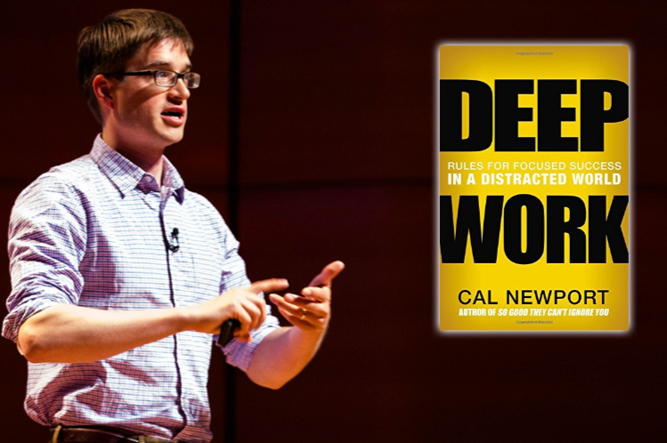

# Galvanize Immersive Hacks
## Taking Notes and Active Recall

---

## Objectives
By the end of this session, you will be able to...

1. Articulate your personal reason for taking notes
1. Explain the benefits of _Active Recall_
1. Describe a note taking technique that is _Idea Centric_, and encourages you to engage in _Active Recall_

---
### All of these ideas are from Cal Newport and his Study Hacks Blog

---

## Objectives
By the end of this session, you will be able to...

1. **Articulate your personal reasons for taking notes**
1. Explain the benefits of _Active Recall_
1. Describe a note taking technique that is _Idea Centric_, and encourages you to engage in _Active Recall_

---
## Why do you take notes?

---
## How do the most effective Galvanize students approach note-taking?
> "[Think](http://calnewport.com/blog/2007/07/20/monday-master-class-part-2-in-60-seconds-or-less/) of studying as an industrial process. The input is pieces of information delivered to you in the form of lectures and reading assignments. This raw material must be processed into coherent ideas, which unify the information around themes and explanatory theories."

---
## How do the most effective Galvanize students approach note-taking?

* Make your notes _Idea Centric_

* You want to get to writing and explaining code as quickly as possible.

---
## Objectives
By the end of this session, you will be able to...

1. **Articulate your personal reasons for taking notes**
1. Explain the benefits of _Active Recall_
1. Describe a note taking technique that is _Idea Centric_, and encourages you to engage in _Active Recall_

---
## Objectives
By the end of this session, you will be able to...

1. Articulate your personal reasons for taking notes
1. **Explain the benefits of _Active Recall_**
1. Describe a note taking technique that is _Idea Centric_, and encourages you to engage in _Active Recall_

---

---
* What are the benefits of Active Recall?
* How can you use Active Recall during your time in the Immersive Program?

---

## Objectives
By the end of this session, you will be able to...

1. Articulate your personal reasons for taking notes
1. Explain the benefits of _Active Recall_
1. **Describe a note taking technique that is _Idea Centric_, and encourages you to engage in _Active Recall_**

---
## Objectives
By the end of this session, you will be able to...

1. **Articulate your personal reasons for taking notes**
1. **Explain the benefits of _Active Recall_**
1. **Describe a note taking technique that is _Idea Centric_, and encourages you to engage in _Active Recall_**
