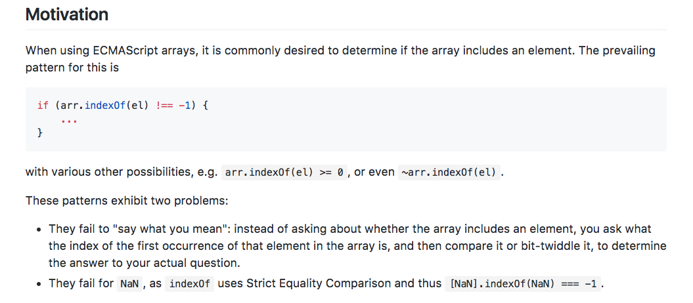
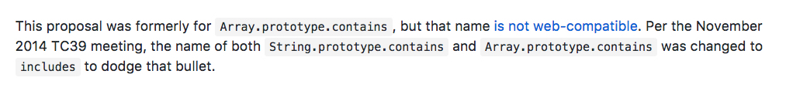
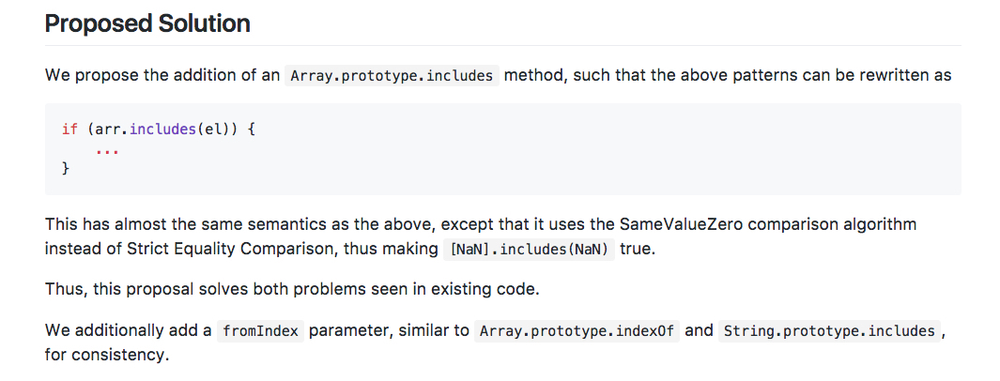
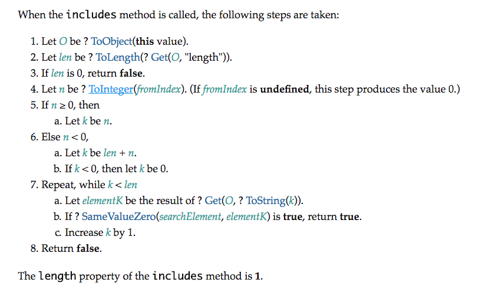
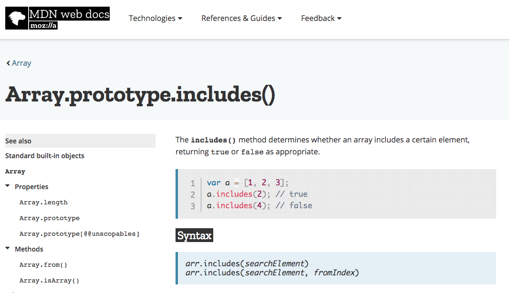
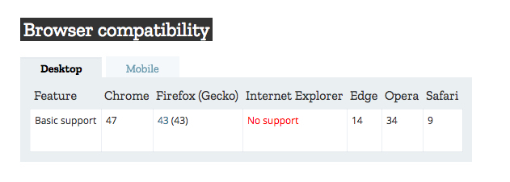
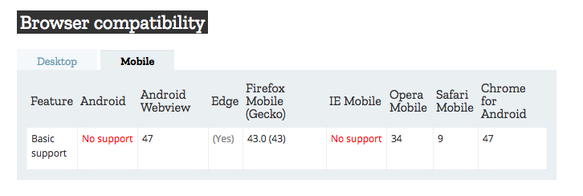

footer: kimschlesinger.com
slidenumbers: true

# What the HECKmaScript?


Kim Schlesinger
@colorado_kim

---

## Hi, I'm Kim!


- Web Development Instructor at Galvanize
- Full-Stack JavaScript Developer
- Colorado Person
- Bikram Yoga Teacher

---
## Why?


```js
//ES5
function sayHi(name) {
  return 'Hi, ' + name + '!'
};


//ES6
const sayHi = (name) => {
  return `Hi, ${name}!`
};
```

^ Different keywords to declare variables

^ Fat arrows for functions

^ Template literals

^ Oh my!


---

## Danny

---


## What is ECMA?

**Before 1994**
European Computer Manufacturers Association 🇪🇺

**After 1994**
ECMA International- European Association for Standardizing Information and Communication Systems 🌏

^ The rise of computers began in the 1950s. At that time, there were several different computer manufacturers and each one used programming languages in different ways.

^ In order to make programming languages that would work on multiple machines, multiple manufacturers came together and agreed to collaborate and create standards around operational techniques.

^ First meeting was in June of 1961

^ Currently creates the standards for Open Office XML, Common Language Infrastructure, C# and ECMAScript

---

## A Brief History of JavaScript


^ Written in 1996 by Brenden Eich and worked only on the Netscape Browser

^ IE had it's own version called JScript

^ This was a nightmare for developers, because they had to write slightly different code for each different browser

^ In 1996, Netscape gave JS to ECMA so a standard would be Written

^ In 1997, the first version of ECMAscript was published

---

## ECMAScript vs. JavaScript


### Copy Machine
#### vs.
### Xerox Machine

---

## TC39 Process

# 🏃🏿‍♀️   🏃🏼    🏃🏿‍♀️

^ Note: There are not multiple TCs for ECMAScript. TC39 is the name and number of the committee specifically devoted to ECMAScript.

^ TC38, TC40, etc.

---

## A Story

```js
//ES6

Array.prototype.includes()

let messageArr = ["Hello", "my", "friends", "!"];


messageArr.includes("Hello");   // true
messageArr.includes("enemies");   //false

```

^ I will explain the TC39 process by telling you the story of how Array.includes() made its way into the latest spec

^ .includes() became official when ES6 was released

---

## Stage 0: Strawman


^ Anyone can make a suggestion

---

## Stage 1: Proposal


^ Make the case for the new feature

^ Describe the shape of a solution

^ Identify potential challenges

^ Create polyfills and demos of the feature

---
# ❓  ❔  ❓


```js
Array.prototype.contains()

let numbersArr = [88, 32, 1985];


numbersArr.contains(1985);   // true
numbersArr.contains(2);   //false

```

---

## Stage 2: Draft


^ Precisely describe the syntax and semantics using formal spec language

^ First draft of the specification

---



---

## Stage 3: Candidate


^ Time to get feedback!

^ A very good draft of the spec

---
## Name Change

```js
Array.prototype.contains()
```
🔫

```js
Array.prototype.includes()
```





---



---

## Stage 4: Finished


^ After feedback and consensus, the feature is adopted in the ECMAScript spec

---
## Spec


---

## MDN



---

## Desktop Browser Adoption



---

## Mobile Browser Adoption



---

# Recapitulation!


---
## I Wanted To Know _How_

```js
//ES5
function sayHi(name) {
  return 'Hi, ' + name + '!'
};


//ES6
const sayHi = (name) => {
  return `Hi, ${name}!`
};
```
---

## JavaScript vs. ECMAScript

**JavaScript** is like a ______________ machine.

**ECMAScript** is like a ______________ machine.

---
## JavaScript vs. ECMAScript

**JavaScript** is like a Xerox machine.

**ECMAScript** is like a copy machine.

---
## TC39 Process

Stage | Name | Action |   
---| --- | :-----------: |
0 | Strawman      | Allow input  |     
1 | Proposal      | Make the case for the new feature, describe a solution, ID challenges|     
2 | Draft |      Get and implement feedback |
3 | Candidate |  Write the spec, write tests, and make a pull request             |  
4 | Finished  |  Publish the spec             |


---
## Questions?

---

# Thank You!

kim.schlesinger@galvanize.com

@colorado_kim

kimschlesinger.com

😄 💙
