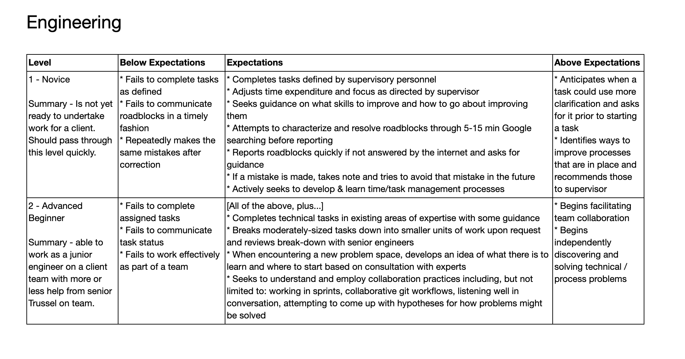
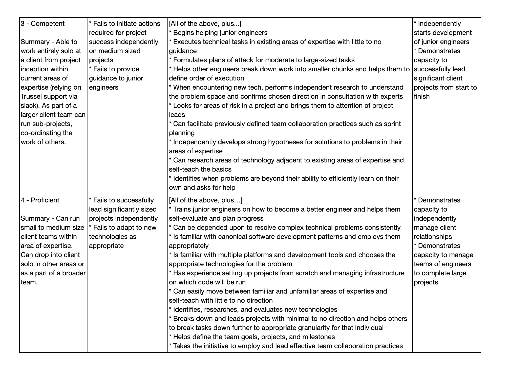

footer: kimschles
slidenumbers: true

# Zero to SRE 

## Kim Schlesinger
### ReactiveOps and diversity 

--- 

# Kim Schlesinger
### Ops, Education & Software 

---

---

---
# My Journey 

--- 
# Zero to SRE 

--- 
# Before, During and After 

* Before you make your hire, what should be true?
* First Day, Week, 90 Days and Year 

--- 
# What should be true about your company _before_ you hire junior engineers?

---
# Sarah Zelechoski, VP of Engineering at ReactiveOps

--- 
# 20% Time for Learning 

--- 
# Culture of Error 

--- 
# Make engineering teams, not individual engineers, critical to your bottom line. 

---

### Before hiring junior engineers, strive to create a compassionate environment where all engineers can learn and grow. 

---
# Preparing and Pulling It Off 

* **Before you make your hire, what should be true?**
* First Day, Week, 90 Days and Year

---
# Preparing and Pulling It Off 

* Before you make your hire, what should be true?
* **First Day, Week, 90 Days and Year**

---
# First Day 
Your leadership team should have these ready for your new hire: 

* Leveling doc
* Technical Onboarding Curriculum   

--- 
# First Day 

Your engineering teams should:

* Start integrating the new hire onto their team 
* Communicate a timeline for contributing to your codebase/client work 

---
# Gradual Release of Responsibility 

--- 
# First Day 

Clear, Measurable Behavioral Expectations

--- 
From [Truss](truss.works) Leveling Doc  

--- 
From [Truss](truss.works) Leveling Doc

--- 

---

# First Day
# Technical Onboarding Curriculum 

--- 
# Example Topics: 

* Git 
* yaml 
* Shell Commands 
* VPC with AWS and GCP 
* Docker
* Kubernetes 

--- 
# Outcomes-Based

* Your junior engineer should complete projects, large and small, as part of the curriculum
* Work with the new hire to set deadlines
* Setup a process that makes it easy for the new hire to ask for help 
* Better yet, set up recurring checkins 

--- 
# ReactiveOps Technical Onboarding Curriculum 

<example>

---
# First Day 
Communicate a timeline for contributing to your codebase/client work 

## 1 week, 1 month, 6 months? 

--- 
# First Week 
Pairing and Real Work

--- 
# First Week 

Prioritize developing muscle memory and getting exerience over mastering theory and concepts 

--- 
# First Week 

Glossary and Active Recall 

^ Show wiki 

--- 

# First 90 Days 

Start flipping the ratio of learning plan work to work on the codebase 

--- 
# First 90 Days 

--- 
# First 90 Days 

--- 
# Recap 
Hire junior engineers
Support them by setting goals in a learning plan and an engineering ladder 
Get them doing real work ASAP through pairing and breaking down tasks into something they can do 

--- 

hirediversity.us 
reactiveops.com
kimschlesinger.com

---

