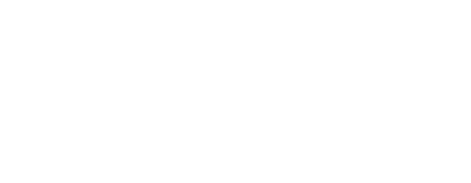

footer: @kimschles


# Zero to SRE 

## Kim Schlesinger

---
# Thesis Statement  

---


# Kim Schlesinger
### Ops, Software & Education


---


---



---
# My Journey to Site Reliability Engineering


--- 


--- 
# Zero to SRE 

--- 

# 1. Prepare (image)
# 2. Pull it Off (image)

--- 
# What should be true about your company _before_ you hire junior engineers?

---


--- 
# Guarantee 20% Time for Learning 

--- 
picture of capacity planning spreadsheet 

--- 
# Create a Culture of Error 


--- 
# Make engineering teams, not individual engineers, critical to your bottom line. 


---
# Prepare (image)

---

# Pull it Off (image)

---
# First Day 


--- 
# First Week 


--- 
# First 90 Days 


--- 
# First Year 


--- 

# First Day 


--- 
# Clear and Measurable Expectations


--- 
# Engineering Leveling Doc


--- 
From [Truss](truss.works) Leveling Doc  


--- 


---


##  Prepare a technical onboarding curriculum that is aligned with the day-to-day work of your engineers.


--- 
# Example Topics for Technical Onboarding: 

* git and linux commands
* yaml 
* VPC with AWS and GCP 
* Docker and Kubernetes 

--- 

##  Your junior engineer should independently complete large and small projects as part of their technical onboarding. 

---

(picture for systems of accountability and support)


--- 
# ReactiveOps Technical Onboarding Curriculum 

<example>


---
# First Day 


---
# Integrate your new hire into their team.[^1]


[^1]: Photo by #WOCinTech Chat.

^ Introduce them to the team and get them scheduled for all team meetings

--- 

## Be explicit about your desired timeline for the junior SRE's first independent contribution. 


--- 
# First Week 


--- 
# Pairing and Real Work 


--- 


--- 
# People learn concrete-to-abstract, not abstract-to-concrete.[^2]


[^2]: kylecoberly.com 


--- 
# Concrete 

```yaml
kubectl get services -n kube-system
kubectl get pods -n kube-system  
kubectl get pods -n kube-system -o wide 
```

--- 
# Abstract


--- 


^ Have a one-on-one with your new hire and do this on a regular interval, weekly if possible

--- 

# First 90 Days 


---

# Review the new engineer's progress as compared against your leveling doc.

--- 

90 Day Trial Period

--- 
# First 90 Days 

* Start flipping the ratio of learning plan work to work on the codebase 

--- 
### Encourage formal learning through exam prep, a book club, or an online course.


--- 
# First 90 Days 

* Start hiring more juniors
* It's lonely if you're the only junior in an ocean of seniors 

--- 
# First Year 

* Review the new engineer's progress as compared against the leveling doc
* Promote them if they've leveled up! 
* Pat yourself on the back 

--- 


--- 

# Thesis statement 

---


## kimschlesinger.com
## hirediversity.us 
## reactiveops.com


